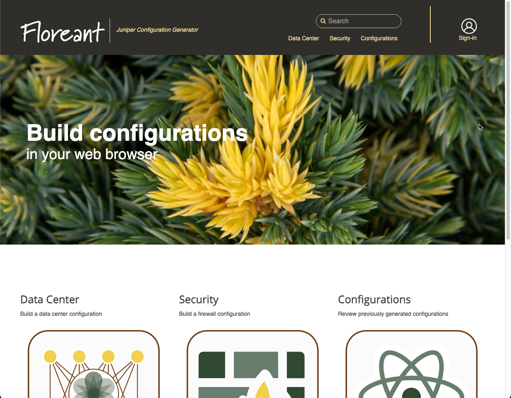
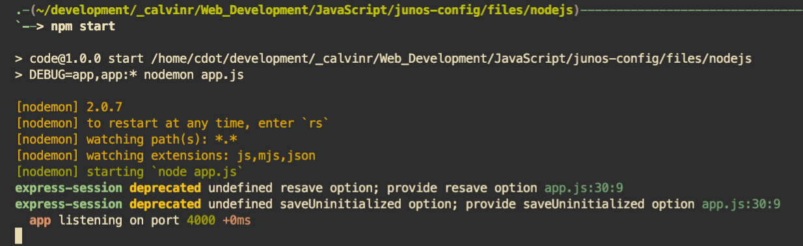

# Floreant

<h1 align="center"><br/>Floreant</h1>

Create a new production-ready Junos configuration with <b>backend</b> (JavaScript), <b>frontend</b> (JavaScript, TypeScript)<br/>

<p align="center">
  <a href="https://gitlab.com/_calvinr/web/javascript/floreant/-/releases" target="_blank"></a>
  <a href="https://gitlab.com/_calvinr/web/javascript/floreant/-/releases" target="_blank"></a>
  
</p>

## ⚡️ Quick start

First of all, [download](https://docs.npmjs.com/downloading-and-installing-node-js-and-npm) and install **npm**. Version `6.1` or higher is required.

As standard with most JavaScript projects, the `packages.json` file found in `files/nodejs` directory contains a couple of scripts to help you get off the ground and running.

Installation is done by using the [`npm install`](https://docs.npmjs.com/cli/v7/commands/npm-install) command within the `files/nodejs` directory

```bash
# Change into the directory containing source code
cd files/nodejs

# Install package dependencies
npm install
```

Let's start up our web app via **npm start** in current folder:

```bash
# Start our application with nodemon
npm start
```

Next, open a web browser and navigate to localhost:5000

<h1 align="center"><br/>Floreant</h1>

That's all you need to know to start! 🎉

### 🐳 Docker-way to quick start

If you don't want to install npm and dependencies to your system, feel free to using our official [Docker image](https://hub.docker.com/r/packetferret/floreant) and run the application from within the container:

```bash
docker run --rm -it -v ${PWD}/files/nodejs:/usr/src/app -w /usr/src/app packetferret/floreant:latest npm start
```

## ⚠️ Update your database path

If you have decided to use a native NodeJS deployment, please make sure to update the path for your database connection parameters in the following files before proceededing.

- [files/nodejs/src/routers/adminRouter.js](https://gitlab.com/_calvinr/web/javascript/floreant/-/blob/master/files/nodejs/src/routers/adminRouter.js)
- [files/nodejs/src/routers/authRouter.js](https://gitlab.com/_calvinr/web/javascript/floreant/-/blob/master/files/nodejs/src/routers/authRouter.js)
- [files/nodejs/src/routers/configsRouter.js](https://gitlab.com/_calvinr/web/javascript/floreant/-/blob/master/files/nodejs/src/routers/configsRouter.js)
- [files/nodejs/src/config/strategies/local.strategy.js](https://gitlab.com/_calvinr/web/javascript/floreant/-/blob/master/files/nodejs/src/config/strategies/local.strategy.js)

Container based deployments can continue with the defaults, but you'd likely want to polish them up before shipping into production.

> 🔔 Please note: there is an expectation that the application can talk to a Mongo DB server in your environment.

## 📖 Project Wiki

The best way to better explore all the features of the **Floreant** web application is to read the project [Wiki](https://gitlab.com/_calvinr/web/javascript/floreant/-/wikis/home) and/or [Issues](https://gitlab.com/_calvinr/web/javascript/floreant/-/issues). Yes, the most frequently asked questions (_FAQ_) are also [here](https://gitlab.com/_calvinr/web/javascript/floreant/-/wikis/home).

## ⚙️ Commands & Options

### `npm start`



- 📺 Full demo video: https://recordit.co/OQAwkZBrj
- 📖 Docs: https://gitlab.com/_calvinr/web/javascript/floreant/-/wikis/home

## 📝 Production-ready project templates

### Backend

- Backend template with JavaScript's EJS built-in [ejs](http://ejs.co/#docs) package:

### Frontend

- Frontend is pure JavaScript today
- Angular overhaul will be ready by release 0.1.0

## ⭐️ Project assistance

If you want to say **thank you** or/and support active development of `Floreant` web application:

- Add a [Star](https://gitlab.com/_calvinr/web/javascript/floreant) to the project.

Together, we can make this project **better** every day! 😘

## ⚠️ License

`Floreant` is free and open-source software licensed under the [Apache 2.0 License](https://gitlab.com/_calvinr/web/javascript/floreant/blob/master/LICENSE). Official [logo](https://gitlab.com/_calvinr/web/javascript/floreant/wiki/Logo) was created by [Calvin Remsburg](https://localhost) and distributed under [Creative Commons](https://creativecommons.org/licenses/by-sa/4.0/) license (CC BY-SA 4.0 International).